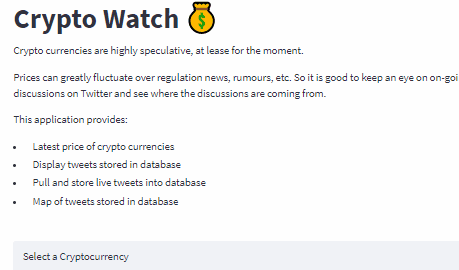

# Crypto Watch 💰

Crypto currencies are highly speculative, at lease for the moment.  
Prices can greatly fluctuate over regulation news, rumours, etc. So it is good to keep an eye on on-going discussions on Twitter and see where the discussions are coming from.

## Features
This application consists:
- Latest price of crypto currencies
- Display tweets stored in database
- Pull and store live tweets into database
- Map of tweets stored in database

## Technologies Used
Python, Pandas, MongoDB, Geopy, Folium, Tweepy, Yfinance, Streamlit

## Contact
[LinkedIn](https://www.linkedin.com/in/guang-hui-liew/)
